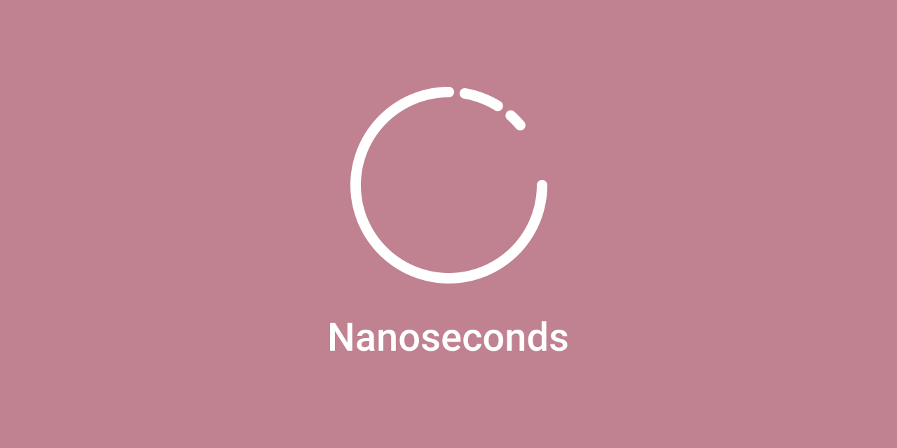

Simple high resolution time stamps for swift developers, along with helpful tools to work with them.

## Key Features

- High resolution time stamp
- Built-in operators overloads
- Useful extensions for unit conversion
- Covert time intervals to a human readable strings
- Linux compatible

## Install

Install via the [**Swift Package Manger**](https://swift.org/package-manager/) by declaring **Nanoseconds** as a dependency in your  `Package.swift`:

``` swift
.package(url: "https://github.com/dominicegginton/Nanoseconds", from: "1.0.0")
```

Remember to add **Nanoseconds** to your target as a dependency.

## Documentation

#### Creating Timestamps
Creating high resolution timestamps with nanosecond accuracy is easy, simply create a instant of `Now` struct

```  swift
let foo = Now()
```

#### Creating Time Intervals

Use the built-in operators overloads to easily calculate and initialize [**TimeInterval**](https://developer.apple.com/documentation/foundation/timeinterval):

``` swift
let start = Now()
sleep(1)
let end = Now()
let duration = end - start
print(duration)  //=> 1004222113.0
```

#### Convert Time Intervals from Nanoseconds to Other Time Units

To convert [**TimeInterval**](https://developer.apple.com/documentation/foundation/timeinterval) objects from nanosecond to a different unit simply use a provided extension:

- nanoseconds
- microseconds
- milliseconds
- seconds
- minutes
- hours

``` swift
print(duration.milliseconds)  //=> 1004.22211
print(duration.seconds)  //=> 1.004222113
```
#### Create TimeIntervals Objects from any time unit

Use a provided init method to create a [**TimeInterval**](https://developer.apple.com/documentation/foundation/timeinterval) object from any time unit

``` swift
let duration = TimeInterval(seconds: 8)
```

#### Covert TimeIntervals Objects to human readable strings

Use the provided `timeString` variable to convert [**TimeInterval**](https://developer.apple.com/documentation/foundation/timeinterval) objects into a human readable format:

``` swift
let duration = TimeInterval(hours: 1) + TimeInterval(seconds: 120)
print(duration.timeString)  //=> 1h 1m 30s
```
